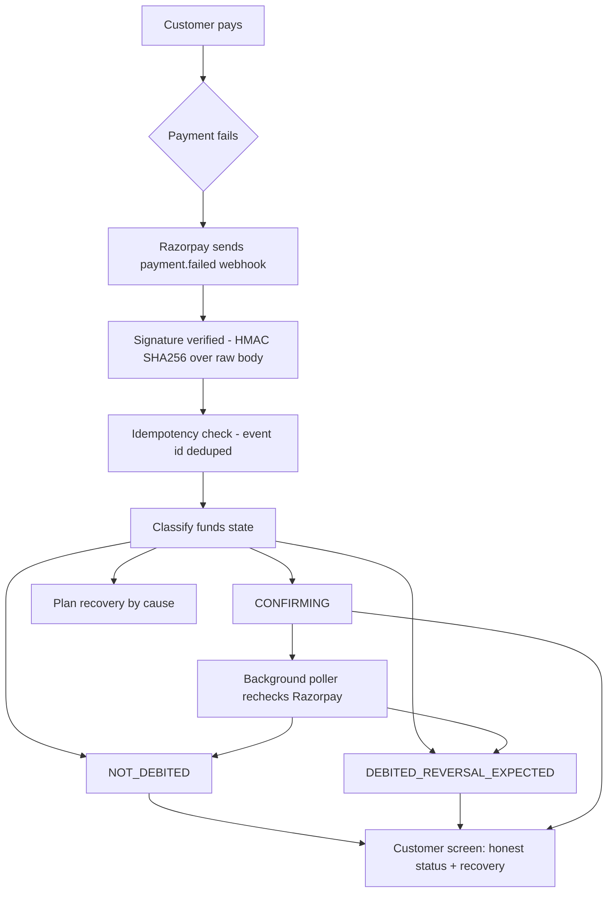

# Honest Payment Failure & Intent-Based Recovery

Proof-based payment-status transparency and cause-driven fresh-intent recovery, built on Razorpay's `payment.failed` webhook.

When an online payment fails in India, the customer gets a bank debit SMS, a checkout that says "failed", and no explanation of the gap between the two. They don't know whether the money left, whether it's coming back, or whether paying again will double-charge them. This service closes that gap: it tells the customer the truth about their money, and offers the recovery path most likely to succeed for that specific failure.

**Live:** https://payment-failure-recovery.onrender.com

---

## The core delta

| | Standard checkout | This engine |
|---|---|---|
| On failure, customer is told | "Payment failed, try again" | Exactly what happened to their money |
| Money status | Unstated | Three proof-based states (see below) |
| Proof of debit | None | Acquirer reference (RRN / UPI txn id) or an honest "still confirming" |
| Retry | Same method, blindly | Cause-driven: switch method / wait / retry now |
| Failed funds | — | Never captured — left to the bank's auto-reversal; recovery is always a fresh payment |

The failed payment's money is **never** re-applied to the order. Under banking rules it auto-reverses to the customer; recovery means offering a clean new payment, not capturing failed funds.

---

## Architecture



---

## The rule the whole system is built on

**Never claim money was debited unless the payload proves it.** Proof is an acquirer reference (RRN for cards, UPI transaction id) — the acquiring bank only issues that once the transaction has reached the banking rail.

Three funds states, never a guess:

| State | When | What the customer reads |
|---|---|---|
| `NOT_DEBITED` | Failed before authorization (wrong OTP, invalid CVV, etc.) | "No money left your account" |
| `DEBITED_REVERSAL_EXPECTED` | Acquirer reference present | "Your money is on its way back", with the reference and an expected date |
| `CONFIRMING` | Failed at authorization with no reference yet | "We're checking with your bank" — no invented reversal date |

The `CONFIRMING` state is deliberate. Most systems would guess; guessing wrong about someone's money is worse than admitting uncertainty. And it isn't a dead end — a background poller resolves it (see below).

---

## Built (MVP — verified in code)

- **3-state honesty engine** — `src/core/classify.js`, `money.js`, `message.js`. Funds state from the webhook payload, with the acquirer-reference rule above.
- **Cause-driven recovery** — `src/core/recovery.js`, `reasons.js`. Expired card → switch to UPI (retrying it can never succeed); low balance → wait; bank outage → wait it out; wrong OTP with customer present → retry now.
- **Active confirming poller** — `src/confirming-poller.js`. An in-process interval ticker (no Redis, no Celery) that rechecks still-`CONFIRMING` real failures against Razorpay's `GET /payments/{id}`, feeds the result through the unchanged classifier, and upgrades the stored row when the state genuinely changes (`CONFIRMING` → `DEBITED_REVERSAL_EXPECTED` / `NOT_DEBITED`). Bounded to recent rows; demo rows skipped.
- **HMAC webhook signature verification** — `src/webhook/signature.js`. `crypto.createHmac('sha256', secret)`, constant-time compare (not `===`), over the raw body, before any JSON parsing. Without this, anyone could POST a forged failure event.
- **Event-level idempotency** — `src/db/`, `src/webhook/handler.js`. `INSERT ... ON CONFLICT DO NOTHING` on `processed_events`, keyed by event id. Razorpay retries deliveries; duplicates are acknowledged and ignored so the customer is never messaged twice.
- **Follow-up suppression** — a scheduled recovery nudge is cancelled if the order is paid before it fires.
- **Live customer-screen auto-update** — `public/failure.html`. The `CONFIRMING` screen re-fetches `/api/failure/:id` every 3 seconds and re-renders itself the moment the poller resolves it — no reload, no WebSockets/SSE, just a plain `setInterval`. A "Simulate bank confirmation (demo only — production uses the background poller)" button on that screen fires the same poller endpoint on demand, for recordings that can't wait on the real interval.
- **Repeatable CONFIRMING demo** — open **`/failure.html?demo=confirming`** and every visit mints its own fresh `CONFIRMING` row (`src/api/demoConfirming.js`, `POST /api/demo/fresh-confirming`) through the same real pipeline a webhook uses (`validateWebhook` → `handleEvent` → classify → decide → message → store) — just without the HTTP layer and signature, since there's no real bank behind a page load. The link never goes stale: reopen it as many times as you want, click the button, watch it upgrade live, reopen again for a brand-new one.
- **Recovery button, not just recovery text** — `public/failure.html`. Clicking the recovery action creates a fresh Razorpay order (`/create-order`, never a capture of the failed payment's funds) and opens Checkout with every payment method available. `recovery.method` is surfaced only as button copy ("Pay again — UPI recommended" / "Try another payment method"), never a hard restriction — so it can never dead-end a customer on a method their account doesn't actually have enabled.
- **Deployed** — Render (Node/Express) + Neon Postgres. 69 tests, CI green (test + secret-scan) on every push.

---

## Future scope (production architecture — not built)

Explicitly not in this MVP. Designed, not implemented:

- **Server-Sent Events / WebSockets** — push the poller's state change to the open customer tab in real time, instead of on next load.
- **Redis + queue worker** — move the poller off the app process to a distributed queue at scale. (In-process polling is deliberate for this scale; a distributed queue is only warranted under real traffic.)
- **Short-lived inventory TTL lock** — hold stock for a few minutes during a fresh recovery payment so a slow customer doesn't hit a stockout.

---

## API

| Method | Path | Purpose |
|---|---|---|
| `POST` | `/webhook/razorpay` | Real webhook pipeline — signature-verified, rate-limited, idempotent |
| `GET` | `/api/failure/:id` | Customer-facing classification + message for a payment |
| `POST` | `/create-order` | Creates a Razorpay order (order-based checkout) |
| `POST` | `/api/simulate-failure` | Feeds a synthetic failure through the real pipeline (demo) |
| `POST` | `/api/demo/fresh-confirming` | Mints a fresh, real `source: 'webhook'` `CONFIRMING` row through the real pipeline — what makes `/failure.html?demo=confirming` repeatable |
| `POST` | `/api/demo/upgrade-confirming` | Runs the real poller against a real CONFIRMING row (Razorpay response simulated, since test mode won't produce a live RRN) |
| `GET` | `/checkout` | Test checkout page |
| `GET` | `/demo` | Demo hub linking every screen |
| `GET` | `/failure.html` `/dashboard.html` | Customer screen and simulation dashboard (static). `/failure.html?demo=confirming` is the repeatable live CONFIRMING demo — see below |
| `GET` | `/healthz` | Health check |

### Sample: `payment.failed` webhook (relevant fields)

```json
{
  "event": "payment.failed",
  "payload": {
    "payment": {
      "entity": {
        "id": "pay_XXXXXXXXXXXXXX",
        "order_id": "order_XXXXXXXXXXXXXX",
        "amount": 149900,
        "method": "card",
        "error_reason": "issuer_down",
        "error_step": "payment_authorization",
        "acquirer_data": { "rrn": "412998877665" }
      }
    }
  }
}
```

Presence of `acquirer_data.rrn` is what moves the classification to `DEBITED_REVERSAL_EXPECTED`. Absence at `payment_authorization` yields `CONFIRMING`, which the poller later resolves.

---

## Edge cases handled

| Case | Handling |
|---|---|
| Forged / spoofed webhook | HMAC SHA256 signature verification over the raw body; bad signature → 401 |
| Duplicate webhook delivery | Event-id idempotency; duplicates acknowledged, processed once |
| Bank confirms RRN late | State stays honest `CONFIRMING`; poller rechecks every 5 min by default (`CONFIRMING_POLL_MS`) and upgrades it when the reference arrives |
| Order paid before a recovery nudge fires | Pending follow-up suppressed |
| Failure with no acquirer reference | Classified `CONFIRMING`, never falsely marked debited |

---

## Verified state (submission snapshot)

Everything below was re-derived directly from the code and the live deployment — not carried over from memory.

**Tests:** 69 passing (`npm test` → 11 test files, 69 tests)

**Routes**

| Method | Path |
|---|---|
| `GET` | `/healthz` |
| `GET` | `/` (redirects to `/demo`) |
| `GET` | `/demo` |
| `GET` | `/api/failure/:id` |
| `POST` | `/api/simulate-failure` |
| `POST` | `/api/demo/fresh-confirming` |
| `POST` | `/api/demo/upgrade-confirming` |
| `GET` | `/checkout` |
| `POST` | `/create-order` |
| `POST` | `/webhook/razorpay` |
| — | `express.static(public/)` — serves `failure.html`, `dashboard.html`, `demo.html`, `showcase/index.html` directly |

**`src/` layout**

```
src/
├── api/
│   ├── demoConfirming.js
│   ├── demoUpgrade.js
│   ├── failureLookup.js
│   └── simulate.js
├── config.js
├── confirming-poller.js
├── core/
│   ├── classify.js
│   ├── message.js
│   ├── money.js
│   ├── reasons.js
│   └── recovery.js
├── db/
│   └── index.js
├── fixtures.js
├── followup-ticker.js
├── index.js
├── logger.js
├── render.js
├── server.js
└── webhook/
    ├── handler.js
    ├── signature.js
    └── validate.js
```

**Confirmed real, not aspirational:**

- **HMAC signature verification** — `src/webhook/signature.js`: `crypto.createHmac('sha256', secret)` + `crypto.timingSafeEqual` (constant-time), over the raw request body, before any JSON parsing.
- **Event-level idempotency** — `src/db/index.js` `markEventSeen()`: `INSERT OR IGNORE` (SQLite) / `ON CONFLICT (event_id) DO NOTHING` (Postgres) on `processed_events`.
- **Confirming poller** — `src/confirming-poller.js` `startConfirmingPoller()`: a real `setInterval`, wired into `src/index.js` at boot with `config.confirmingPollMs`.
- **Confirming-page live auto-refresh + repeatable demo** — `public/failure.html` `watchForUpdate()`: a plain `setInterval` (3s) re-fetches `/api/failure/:id` only while `state === 'CONFIRMING'`, re-renders on change, stops on resolution. Opening `/failure.html?demo=confirming` mints a brand-new `CONFIRMING` row on every visit (`src/api/demoConfirming.js`) so the link is reusable indefinitely, not a one-shot; its "Simulate bank confirmation (demo only — production uses the background poller)" button triggers the same real poller endpoint for a one-click live demo.
- **Recovery button with method recommendation** — `public/failure.html` `buildRecoveryAction()`: creates a fresh order and opens Checkout with every method available, labelling the button per `recovery.method` without ever restricting which methods Checkout shows.

**Live:** https://payment-failure-recovery.onrender.com
**Commit:** `9f9d117a78bc4c6fb9a695cda95a0d802c5d4bb5`

---

## Run it

```bash
npm install
cp .env.example .env      # test-mode Razorpay keys only
npm test                  # 69 tests
npm start
```

Env: `DATABASE_URL` (Postgres), `RAZORPAY_KEY_ID`, `RAZORPAY_KEY_SECRET`, `RAZORPAY_WEBHOOK_SECRET`, `CONFIRMING_POLLER`, `CONFIRMING_POLL_MS`. Secrets live in the environment, never in the repo.

---

## What is real vs modelled

- **Real:** the classification logic, signature verification, idempotency, the poller, the recovery decisions, the live deployment, the tests.
- **Modelled:** every number on the dashboard (recovery rates, support-contact rates) — labelled on the page as modelled, not measured, because there's no real merchant traffic behind them.
- **Simulated in demo:** the `payment.failed` cases that test mode can't produce (a real bank debit with RRN) are driven through the real pipeline with production-shaped payloads. Same code path, controlled input.
