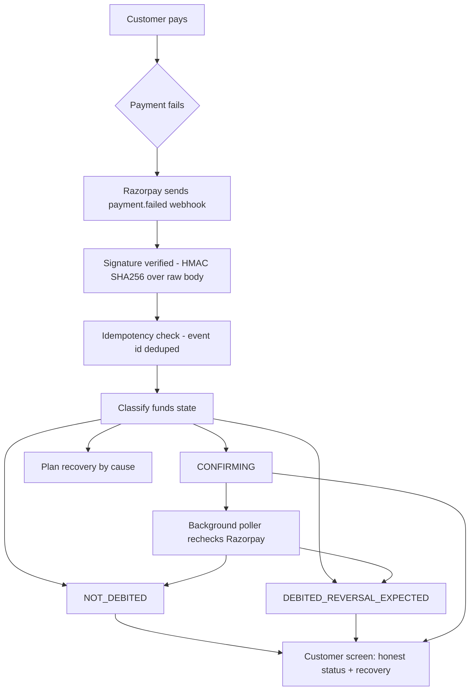

# Honest Payment Failure & Intent-Based Recovery

Proof-based payment-status transparency and cause-driven fresh-intent recovery, built on Razorpay's `payment.failed` webhook.

When an online payment fails in India, the customer gets a bank debit SMS, a checkout that says "failed", and no explanation of the gap between the two. They don't know whether the money left, whether it's coming back, or whether paying again will double-charge them. This service closes that gap: it tells the customer the truth about their money, and offers the recovery path most likely to succeed for that specific failure.

**Live:** https://payment-failure-recovery.onrender.com

---

## Five pillars

| # | Pillar | In one line |
|---|---|---|
| 1 | [Zero-Capturing Compliance](#1-zero-capturing-compliance) | Failed funds are never recaptured — recovery is always a fresh payment |
| 2 | [Proof-Based 3-State Honesty](#2-proof-based-3-state-honesty) | No debit is ever claimed without an acquirer reference as proof |
| 3 | [MVP vs Production](#3-mvp-vs-production) | What's built and verified vs. what's designed but explicitly not built |
| 4 | [Modelled ROI](#4-modelled-roi) | Every dashboard number is labelled modelled, never presented as measured |
| 5 | [Security & Edge-Case Matrix](#5-security--edge-case-matrix) | HMAC verification, idempotency, and honest handling of webhook delay |

---

## 1. Zero-Capturing Compliance

A failed payment's money is **never** captured or re-applied to the order. Under banking rules it auto-reverses to the customer on its own — this service never touches it, never tries to "complete" it, and never treats it as available funds.

Recovery is always a **fresh payment**, for the same purchase, not a retry or a capture of the failed one:

- The recovery button on the customer screen (`public/failure.html`) calls `POST /create-order` to create a brand-new Razorpay order, then opens Checkout for that new order — never the failed payment.
- The recovery engine's method decision (`recovery.method` from `src/core/recovery.js`) is surfaced as the **recommended method**, in the button's own label — "Pay again — UPI recommended" or the neutral "Try another payment method" when there's nothing specific to recommend. It is never used to lock Checkout to a single method; Checkout always opens with every method the account supports, so a recommendation can never turn into a dead end.
- Nothing here claims to offer Cash on Delivery, Pay Later, or any payment method this service doesn't actually integrate — the only options a customer ever sees are whatever Razorpay Checkout itself renders for a fresh order.

---

## 2. Proof-Based 3-State Honesty

**Never claim money was debited unless the payload proves it.** Proof is an acquirer reference (RRN for cards, UPI transaction id) — the acquiring bank only issues that once the transaction has actually reached the banking rail. Absent that reference, the system says so instead of guessing.

Three funds states, never a guess:

| State | When | What the customer reads |
|---|---|---|
| `NOT_DEBITED` | Failed before authorization (wrong OTP, invalid CVV, etc.) | "No money left your account" |
| `DEBITED_REVERSAL_EXPECTED` | Acquirer reference present | The reference itself (RRN / UPI transaction id) and an **expected reversal date**, computed as working days from the event — not a vague SLA promise |
| `CONFIRMING` | Failed at authorization with no reference yet | "We're checking with your bank" — no invented reversal date |

`CONFIRMING` is not a dead end — it is **actively resolved**, two ways:

- **In production**, `src/confirming-poller.js` runs an in-process `setInterval` (`CONFIRMING_POLL_MS`, 5 minutes by default) that rechecks still-`CONFIRMING` real failures against Razorpay's `GET /payments/{id}`, feeds the result through the unmodified classifier, and upgrades the row the moment the state genuinely changes.
- **On the customer screen itself**, `public/failure.html` polls `/api/failure/:id` every 3 seconds while the state is `CONFIRMING` and re-renders the moment it resolves — no reload, no WebSockets/SSE, a plain `setInterval`.



---

## 3. MVP vs Production

### Built (verified in code)

- **3-state honesty engine** — `src/core/classify.js`, `money.js`, `message.js`. Funds state from the webhook payload, with the acquirer-reference rule above.
- **Cause-driven recovery** — `src/core/recovery.js`, `reasons.js`. Expired card → switch to UPI (retrying it can never succeed); low balance → wait; bank outage → wait it out; wrong OTP with customer present → retry now.
- **Active confirming poller** — `src/confirming-poller.js`. An in-process interval ticker (no Redis, no Celery) that rechecks still-`CONFIRMING` real failures, feeds the result through the unchanged classifier, and upgrades the stored row when the state genuinely changes. Bounded to recent rows; demo rows skipped.
- **HMAC webhook signature verification** — `src/webhook/signature.js`. `crypto.createHmac('sha256', secret)`, constant-time compare, over the raw body, before any JSON parsing.
- **Event-level idempotency** — `src/db/`, `src/webhook/handler.js`. `INSERT ... ON CONFLICT DO NOTHING` on `processed_events`, keyed by event id.
- **Follow-up suppression** — a scheduled recovery nudge is cancelled if the order is paid before it fires.
- **Live customer-screen auto-update** — `public/failure.html`. The `CONFIRMING` screen re-fetches and re-renders itself on resolution (see Pillar 2).
- **Repeatable CONFIRMING demo** — `/failure.html?demo=confirming` mints a fresh `CONFIRMING` row on every visit (`src/api/demoConfirming.js`, `POST /api/demo/fresh-confirming`), through the same real pipeline a webhook uses. A "Simulate bank confirmation (demo only — production uses the background poller)" button fires the real poller endpoint on demand.
- **Recovery button, not just recovery text** — see Pillar 1.
- **Deployed** — Render (Node/Express) + Neon Postgres. 69 tests, CI green (test + secret-scan) on every push.

### Planned (production architecture — explicitly not built)

- **Server-Sent Events / WebSockets** — push the poller's state change to the open customer tab in real time, instead of the current polling `setInterval`.
- **Redis + queue worker** — move the poller off the app process to a distributed queue at scale. In-process polling is a deliberate choice for this scale; a distributed worker is only warranted under real traffic.
- **Short-lived inventory TTL lock** — hold stock for a few minutes during a fresh recovery payment so a slow customer doesn't hit a stockout.

---

## 4. Modelled ROI

**Modelled, not measured:** every number on `/dashboard.html` — orders recovered, value recovered, support contacts avoided — is a simulated comparison, generated by `scripts/simulate.js` at a stated sample size (`N = 500` simulated failures) and labelled `modelled` directly on the page. There is no real merchant traffic behind this service, so nothing here is presented as a measured outcome. It's reproducible on demand: `SIM_N=500 node scripts/simulate.js` from the repo root, with every constant it uses declared and named in that script — change any of them and re-run.

**Real, not modelled:** the classification logic, signature verification, idempotency, the confirming poller, the recovery decisions, the live deployment, and the test suite are all real code exercising real logic — none of the *mechanics* behind the dashboard's numbers are simulated, only the traffic volume feeding them is.

**Simulated in demo:** the `payment.failed` cases that Razorpay test mode can't produce on its own (a real bank debit with an acquirer reference) are driven through the real, unmodified pipeline with production-shaped payloads — same code path, controlled input, not a mock.

---

## 5. Security & Edge-Case Matrix

- **HMAC SHA256 signature verification** — `src/webhook/signature.js`. Computed over the raw request body (mounted via `express.raw()` before any JSON parser, so re-serialisation never breaks the hash), compared with `crypto.timingSafeEqual` rather than `===`. An unsigned or forged request never reaches classification.
- **Event-level idempotency against duplicate billing** — `src/db/index.js` `markEventSeen()`: `INSERT OR IGNORE` (SQLite) / `ON CONFLICT (event_id) DO NOTHING` (Postgres) on `processed_events`, keyed by Razorpay's event id. Razorpay retries deliveries on any non-2xx; duplicates are acknowledged and ignored so a customer is never messaged twice for the same failure.
- **Rate limiting on the webhook route** — `express-rate-limit`, default 60 requests / 60 seconds (`RATE_LIMIT_MAX` / `RATE_LIMIT_WINDOW_MS`), applied before signature verification so an abusive burst doesn't even pay for the HMAC check. `trust proxy` is set to a specific hop count (`TRUST_PROXY_HOPS`, default 2 — Render's Cloudflare + load-balancer chain), never `true`, since trusting an unbounded proxy chain lets a client fake its own IP and bypass the limiter entirely.

| Case | Handling |
|---|---|
| Forged / spoofed webhook | HMAC SHA256 signature verification over the raw body; bad signature → 401 |
| Duplicate webhook delivery | Event-id idempotency; duplicates acknowledged, processed once |
| State sync during webhook delay (bank confirms RRN late) | State stays honestly `CONFIRMING` in the meantime; the poller rechecks every 5 min by default (`CONFIRMING_POLL_MS`) and upgrades it the moment the reference arrives — see Pillar 2 |
| Order paid before a recovery nudge fires | Pending follow-up suppressed |
| Failure with no acquirer reference | Classified `CONFIRMING`, never falsely marked debited |

---

## API

| Method | Path | Purpose |
|---|---|---|
| `POST` | `/webhook/razorpay` | Real webhook pipeline — signature-verified, rate-limited, idempotent |
| `GET` | `/api/failure/:id` | Customer-facing classification + message for a payment |
| `POST` | `/create-order` | Creates a Razorpay order (order-based checkout) |
| `POST` | `/api/simulate-failure` | Feeds a synthetic failure through the real pipeline (demo) |
| `POST` | `/api/demo/fresh-confirming` | Mints a fresh, real `source: 'webhook'` `CONFIRMING` row through the real pipeline — what makes `/failure.html?demo=confirming` repeatable |
| `POST` | `/api/demo/upgrade-confirming` | Runs the real poller against a real CONFIRMING row (Razorpay response simulated, since test mode won't produce a live RRN) |
| `GET` | `/checkout` | Test checkout page |
| `GET` | `/demo` | Demo hub linking every screen |
| `GET` | `/failure.html` `/dashboard.html` | Customer screen and simulation dashboard (static). `/failure.html?demo=confirming` is the repeatable live CONFIRMING demo |
| `GET` | `/healthz` | Health check |

### Sample: `payment.failed` webhook (relevant fields)

```json
{
  "event": "payment.failed",
  "payload": {
    "payment": {
      "entity": {
        "id": "pay_XXXXXXXXXXXXXX",
        "order_id": "order_XXXXXXXXXXXXXX",
        "amount": 149900,
        "method": "card",
        "error_reason": "issuer_down",
        "error_step": "payment_authorization",
        "acquirer_data": { "rrn": "412998877665" }
      }
    }
  }
}
```

Presence of `acquirer_data.rrn` is what moves the classification to `DEBITED_REVERSAL_EXPECTED`. Absence at `payment_authorization` yields `CONFIRMING`, which the poller later resolves.

---

## Verified state (submission snapshot)

Everything below was re-derived directly from the code and the live deployment — not carried over from memory.

**Tests:** 69 passing (`npm test` → 11 test files, 69 tests)

**Routes**

| Method | Path |
|---|---|
| `GET` | `/healthz` |
| `GET` | `/` (redirects to `/demo`) |
| `GET` | `/demo` |
| `GET` | `/api/failure/:id` |
| `POST` | `/api/simulate-failure` |
| `POST` | `/api/demo/fresh-confirming` |
| `POST` | `/api/demo/upgrade-confirming` |
| `GET` | `/checkout` |
| `POST` | `/create-order` |
| `POST` | `/webhook/razorpay` |
| — | `express.static(public/)` — serves `failure.html`, `dashboard.html`, `demo.html`, `showcase/index.html` directly |

**`src/` layout**

```
src/
├── api/
│   ├── demoConfirming.js
│   ├── demoUpgrade.js
│   ├── failureLookup.js
│   └── simulate.js
├── config.js
├── confirming-poller.js
├── core/
│   ├── classify.js
│   ├── message.js
│   ├── money.js
│   ├── reasons.js
│   └── recovery.js
├── db/
│   └── index.js
├── fixtures.js
├── followup-ticker.js
├── index.js
├── logger.js
├── render.js
├── server.js
└── webhook/
    ├── handler.js
    ├── signature.js
    └── validate.js
```

**Confirmed real, not aspirational:**

- **HMAC signature verification** — `src/webhook/signature.js`: `crypto.createHmac('sha256', secret)` + `crypto.timingSafeEqual` (constant-time), over the raw request body, before any JSON parsing.
- **Event-level idempotency** — `src/db/index.js` `markEventSeen()`: `INSERT OR IGNORE` (SQLite) / `ON CONFLICT (event_id) DO NOTHING` (Postgres) on `processed_events`.
- **Confirming poller** — `src/confirming-poller.js` `startConfirmingPoller()`: a real `setInterval`, wired into `src/index.js` at boot with `config.confirmingPollMs`.
- **Confirming-page live auto-refresh + repeatable demo** — `public/failure.html` `watchForUpdate()`: a plain `setInterval` (3s) re-fetches `/api/failure/:id` only while `state === 'CONFIRMING'`, re-renders on change, stops on resolution. Opening `/failure.html?demo=confirming` mints a brand-new `CONFIRMING` row on every visit (`src/api/demoConfirming.js`) so the link is reusable indefinitely, not a one-shot; its "Simulate bank confirmation (demo only — production uses the background poller)" button triggers the same real poller endpoint for a one-click live demo.
- **Recovery button with method recommendation** — `public/failure.html` `buildRecoveryAction()`: creates a fresh order and opens Checkout with every method available, labelling the button per `recovery.method` without ever restricting which methods Checkout shows.

**Live:** https://payment-failure-recovery.onrender.com
**Commit:** `d9da3e92f707e737e51faddeeecb30468f8846fd`

---

## Run it

```bash
npm install
cp .env.example .env      # test-mode Razorpay keys only
npm test                  # 69 tests
npm start
```

Env: `DATABASE_URL` (Postgres), `RAZORPAY_KEY_ID`, `RAZORPAY_KEY_SECRET`, `RAZORPAY_WEBHOOK_SECRET`, `CONFIRMING_POLLER`, `CONFIRMING_POLL_MS`. Secrets live in the environment, never in the repo.
